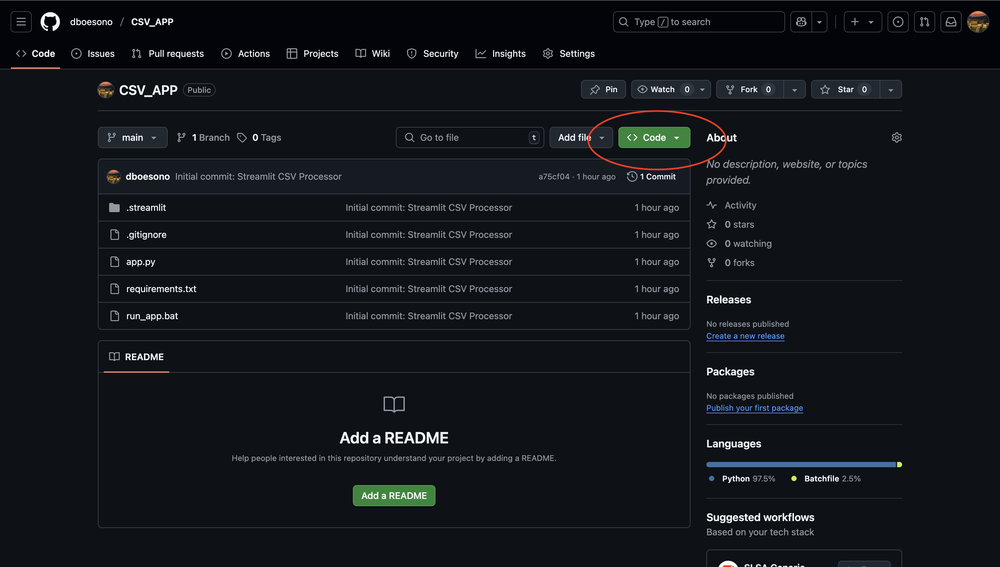
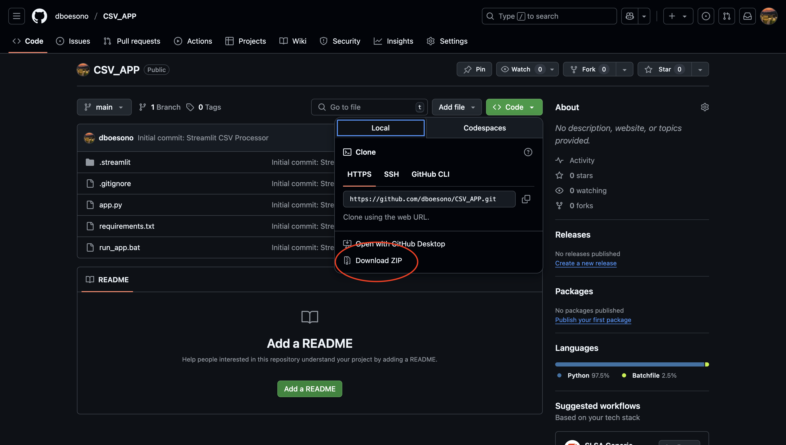

# CSV Processor App

A Streamlit application for cleaning and previewing **Device** and **Alarm** CSV/XLSX datasets, with easy download of processed outputs.

---

## Prerequisites

- **Python 3.8+** installed and on your PATH  
- **pip** (comes with Python)  
- A terminal / PowerShell / Command Prompt (Windows) or shell (macOS/Linux)  

---

## Installation & Setup

1. **Download & extract the ZIP**  
   1. Go to the GitHub repository:  
      https://github.com/dboesono/CSV_APP  
   2. Click **Code ▶ Download ZIP**  
   
   

   3. Save and extract to the Desktop, e.g. `CSV_APP-main.zip`
   4. Inside the zip file, move the `CSV_APP-main` folder outside to the desktop and delete the `CSV_APP-main.zip` file

2. **Open a terminal** from the command prompt and change into the project directory:  
   ```bash
   cd Desktop/CSV_APP-main
   ```

3. **Install Python External Packages:** Write this command line in the command prompt
   ```bash
   pip install -r requirements.txt
   ```

4. Go to this Google Drive [Link](https://drive.google.com/file/d/1FzyPuMeQJ6n217feIUJZTHglPtDGM9FT/view?usp=drivesdk) to download the `run_app.bat` file for you to place it at the desktop

4. Once installation is completed. Double-click the `run_app.bat` file to run the app.
